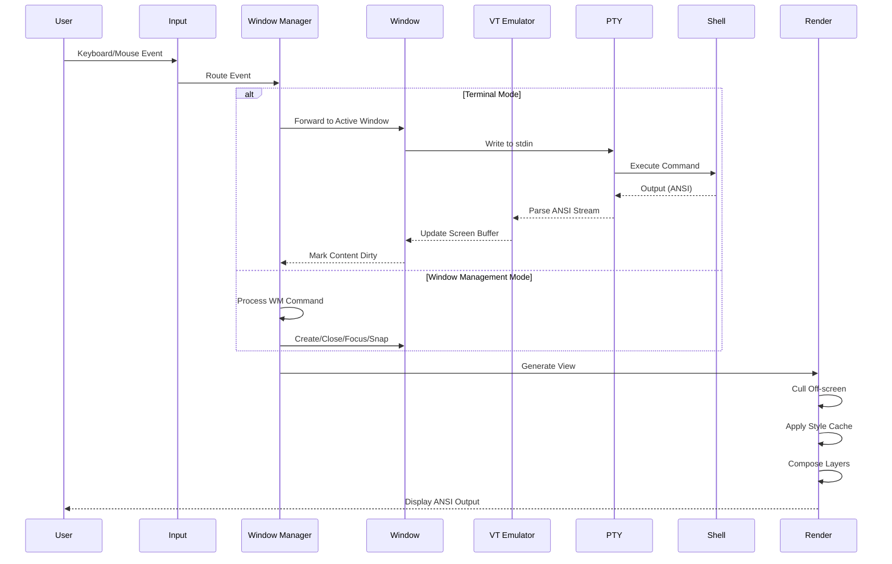
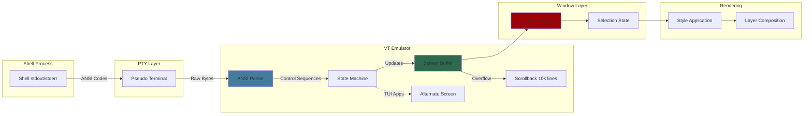
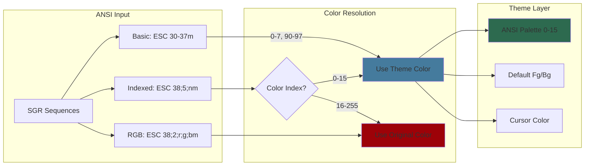
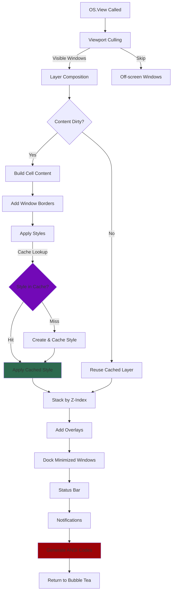

# TUIOS Architecture

This document provides a comprehensive overview of TUIOS's internal architecture, data flow, and component organization.

## Table of Contents

- [Overview](#overview)
- [System Architecture](#system-architecture)
- [Data Flow](#data-flow)
- [Terminal Emulation Stack](#terminal-emulation-stack)
- [Theme Color System](#theme-color-system)
- [Rendering Pipeline](#rendering-pipeline)
- [SSH Server Architecture](#ssh-server-architecture)
- [Core Components](#core-components)

## Overview

TUIOS follows a layered architecture built on the Model-View-Update (MVU) pattern provided by Bubble Tea v2. The application is organized into distinct layers that handle user interaction, window management, terminal emulation, and rendering.

## System Architecture

```mermaid
graph TB
    subgraph "User Interface Layer"
        UI[Terminal Display]
        Input[Keyboard & Mouse Input]
    end

    subgraph "Application Layer"
        OS[OS - Window Manager]
        IH[Input Handler]
        WS[Workspace Manager 1-9]
        ANI[Animation System]
    end

    subgraph "Window Management"
        WIN[Terminal Windows]
        LAYOUT[Layout System]
        TILE[Tiling Manager]
    end

    subgraph "Terminal Emulation"
        VT[VT Emulator]
        PTY[PTY Interface]
        SCROLL[Scrollback Buffer]
    end

    subgraph "Rendering Pipeline"
        RENDER[Rendering Engine]
        CACHE[Style Cache]
        POOL[Object Pools]
    end

    subgraph "External Integration"
        SSH[SSH Server Wish]
        SHELL[Shell Process]
    end

    Input --> IH
    IH --> OS
    OS --> WS
    OS --> WIN
    OS --> ANI
    WIN --> VT
    WIN --> LAYOUT
    LAYOUT --> TILE
    VT --> PTY
    VT --> SCROLL
    PTY --> SHELL
    OS --> RENDER
    RENDER --> CACHE
    RENDER --> POOL
    RENDER --> UI
    SSH --> OS

    style OS fill:#1d3557
    style VT fill:#2d6a4f
    style RENDER fill:#9d0208
    style SSH fill:#457b9d
```



### Component Responsibilities

**User Interface Layer:**

- Handles raw terminal I/O via Bubble Tea
- Processes keyboard and mouse events
- Displays rendered ANSI output

**Application Layer:**

- **OS (Window Manager)**: Central state coordinator, workspace management, mode switching
- **Input Handler**: Routes events based on current mode (Window Management, Terminal, Copy Mode)
- **Workspace Manager**: Manages 9 independent workspaces
- **Animation System**: Smooth transitions for minimize/restore/snap operations

**Window Management:**

- **Terminal Windows**: Individual terminal session containers
- **Layout System**: Window positioning and sizing
- **Tiling Manager**: BSP (Binary Space Partitioning) layout with automatic spiral pattern (alternating vertical/horizontal splits)

**Terminal Emulation:**

- **VT Emulator**: ANSI/VT100 escape sequence parser
- **PTY Interface**: Pseudo-terminal communication with shell
- **Scrollback Buffer**: 10,000 line history

**Rendering Pipeline:**

- **Rendering Engine**: Composites all visual layers
- **Style Cache**: LRU cache for Lipgloss styles (40-60% allocation reduction)
- **Object Pools**: Reusable buffers for strings, bytes, and layers

## Data Flow



### Event Flow

1. **Input Reception**: User generates keyboard or mouse event
2. **Mode Routing**: Input handler determines current mode and routes appropriately
3. **Action Processing**:
   - **Terminal Mode**: Events sent to active window's PTY
   - **Window Management Mode**: Commands modify window state
   - **Copy Mode**: Vim-style navigation and selection
4. **State Update**: OS model updates based on commands
5. **Rendering**: Changes trigger view regeneration with optimizations
6. **Display**: Final ANSI output sent to terminal

## Terminal Emulation Stack



### Terminal Processing

1. **Shell Output**: Shell writes ANSI sequences to stdout/stderr
2. **PTY Capture**: Pseudo-terminal captures raw byte stream
3. **ANSI Parsing**: State machine parses control sequences
4. **Screen Update**: Parsed sequences update screen buffer or alternate screen
5. **Scrollback**: Overflowing lines pushed to scrollback buffer
6. **Caching**: Screen content cached with sequence-based invalidation
7. **Selection**: Copy mode overlays selection state
8. **Styling**: Lipgloss styles applied
9. **Composition**: Final layer composited for rendering

## Theme Color System

TUIOS implements a comprehensive theming system that allows terminals to use
configurable color palettes while maintaining compatibility with standard ANSI
color codes.

### Color Resolution Architecture



### Theme Color Handling

**Basic ANSI Colors (30-37, 40-47, 90-97, 100-107):**

- Automatically mapped to theme's 16-color palette
- Indices 0-7: standard colors (black, red, green, yellow, blue, magenta, cyan, white)
- Indices 8-15: bright variants

**Indexed Colors (38;5;n, 48;5;n, 58;5;n):**

- Colors 0-15: Routed through theme palette for consistency
- Colors 16-255: Pass through unchanged (256-color compatibility)
- Allows TUI apps to benefit from theming while preserving extended colors

**RGB/Truecolor (38;2;r;g;b):**

- Always pass through unchanged
- Preserves application-specified exact colors
- Full 24-bit color support

### SGR Sequence Processing

The VT emulator's SGR handler (`internal/vt/csi_sgr.go`) implements conditional theme routing with fallback to standard processing:

```go
func (e *Emulator) handleSgr(params ansi.Params) {
    // When theming is disabled, use standard ANSI color processing
    if !e.hasThemeColors() {
        uv.ReadStyle(params, &e.scr.cur.Pen)
        return
    }

    // When theming is enabled, route colors through theme palette
    e.readStyleWithTheme(params, &e.scr.cur.Pen)
}
```

**Format Detection and Parameter Handling:**

The handler distinguishes between different color formats by examining the parameter sequence:

```go
// Example: Indexed foreground color ESC[38;5;nm
case 38:
    if i+2 < len(params) {
        next, _, _ := params.Param(i+1, -1)
        if next == 5 { // Indexed color format
            colorIndex, _, _ := params.Param(i+2, -1)
            if colorIndex >= 0 && colorIndex <= 15 {
                // Use themed color for base ANSI palette
                pen.Foreground(e.IndexedColor(colorIndex))
                i += 2  // Skip format indicator and color index
                continue
            }
        }
    }
    // Standard processing for 256-color (16-255) and RGB
    var c color.Color
    n := ansi.ReadStyleColor(params[i:], &c)
    if n > 0 {
        pen.Foreground(c)
        i += n - 1
    }
```

This approach ensures:

- Conditional theme application (only when theme is enabled)
- Consistent color schemes across themed windows
- Respect for application-specific color choices (256-color, RGB)
- Compatibility with legacy and modern terminal applications

### Background Color Treatment

TUIOS uses transparent backgrounds (`nil`) for the terminal's default background to ensure TUI applications render correctly:

```go
// In internal/terminal/window.go
terminal.SetThemeColors(
    theme.TerminalFg(),
    nil,  // Transparent background allows TUI apps to control their own bg
    theme.TerminalCursor(),
    theme.GetANSIPalette(),
)
```

**Design Rationale:**

Most TUI applications (vim, tmux, htop, etc.) expect to control their own background rendering. Setting the terminal's default background to an opaque color would:

- Override application-intended backgrounds
- Break visual elements expecting transparency
- Cause rendering issues with box-drawing characters

By keeping the background transparent, applications can freely use indexed background colors while the outer terminal's background shows through, providing the expected visual appearance.

### Dynamic Theme Updates

TUIOS supports live theme switching without restarting windows:

**Update Flow:**

1. Theme change triggered (user action or config reload)
2. `OS.UpdateAllWindowThemes()` called (`internal/app/os.go`)
3. For each window: `Window.UpdateThemeColors()` (`internal/terminal/window.go`)
4. VT emulator's theme colors refreshed via `Terminal.SetThemeColors()`
5. Windows marked dirty to trigger re-render
6. New theme colors immediately visible

**Theme Components:**

- **Foreground**: Default text color (ESC[39m)
- **Background**: Default background color (ESC[49m)
- **Cursor**: Cursor block color
- **ANSI Palette**: 16 colors (indices 0-15) for SGR sequences

### Implementation Files

| Component         | File                          | Responsibility                             |
| ----------------- | ----------------------------- | ------------------------------------------ |
| **SGR Handler**   | `internal/vt/csi_sgr.go`      | Parse SGR sequences with conditional theme routing; fallback to standard ANSI when theming disabled |
| **Theme Colors**  | `internal/terminal/window.go` | Initialize and update window theme colors with transparent backgrounds |
| **Theme Manager** | `internal/app/os.go`          | Propagate theme changes to all windows     |
| **Theme Config**  | `internal/theme/theme.go`     | Define color palettes and theme variants   |

## Rendering Pipeline



### Rendering Optimizations

1. **Viewport Culling**: Off-screen windows skipped entirely
2. **Content Caching**: Unchanged window content reused from cache
3. **Viewport Clipping**: Window content clipped to viewport bounds using ANSI-aware line-based approach
4. **Drag Bounds Checking**: Mouse operations prevent windows from going off-screen during drag (improves UX and prevents ANSI clipping edge cases)
5. **Style Caching**: Lipgloss styles pooled and reused (LRU cache)
6. **Object Pooling**: String builders, byte buffers, and layer objects pooled
7. **Z-Index Sorting**: Windows stacked by priority (focused, animating, minimized)
8. **Frame Skipping**: No render when no changes and no animations
9. **Adaptive Refresh**: 60Hz base rate, 30Hz during interactions, 20Hz for background windows

## Multi-Client Architecture

TUIOS supports multiple clients connecting to the same daemon session simultaneously. All clients see synchronized state updates in real-time.

### Thread-Safe Event Channels

The multi-client system uses channel-based message passing to prevent race conditions:

```mermaid
graph LR
    subgraph "Network Goroutine"
        CB[Callback Handler]
    end

    subgraph "Channels"
        SSC[StateSyncChan]
        CEC[ClientEventChan]
    end

    subgraph "Bubble Tea Event Loop"
        LSS[ListenForStateSync]
        LCE[ListenForClientEvents]
        UPD[Update Handler]
    end

    CB -->|Non-blocking send| SSC
    CB -->|Non-blocking send| CEC
    SSC -->|Blocking read| LSS
    CEC -->|Blocking read| LCE
    LSS -->|Message| UPD
    LCE -->|Message| UPD

    style SSC fill:#2d6a4f
    style CEC fill:#2d6a4f
    style UPD fill:#1d3557
```



**Event Channels:**

| Channel | Purpose | Events |
|---------|---------|--------|
| `StateSyncChan` | State synchronization from other clients | Mode changes, window updates, workspace switches |
| `ClientEventChan` | Client join/leave notifications | Join with size, leave with count |
| `WindowExitChan` | Window process termination | PTY exit signals |

**Thread Safety:**

- Callbacks from network goroutines send to channels (non-blocking with `select/default`)
- Listener commands read from channels (blocking)
- Messages processed in Bubble Tea's single-threaded Update loop
- Prevents race conditions when iterating over `m.Windows`

### Client Notifications

When clients join, leave, or sync state, notifications are displayed:

- **Client joined/left**: Shows connection count
- **Mode changes**: "Switched to Terminal/Window mode"
- **Window changes**: "Window created/closed (N total)"
- **Workspace changes**: "Switched to workspace N"

## SSH Server Architecture

```mermaid
graph TB
    subgraph "SSH Clients"
        C1[SSH Client 1]
        C2[SSH Client 2]
        C3[SSH Client N]
    end

    subgraph "TUIOS SSH Server :2222"
        WISH[Wish v2 Middleware]
        AUTH[Session Handler]
    end

    subgraph "Isolated Instances"
        OS1[OS Instance 1]
        OS2[OS Instance 2]
        OS3[OS Instance N]
    end

    subgraph "Terminal Sessions"
        W1[Windows + PTY + Shell]
        W2[Windows + PTY + Shell]
        W3[Windows + PTY + Shell]
    end

    C1 -->|SSH Connection| WISH
    C2 -->|SSH Connection| WISH
    C3 -->|SSH Connection| WISH

    WISH --> AUTH
    AUTH -->|Dedicated Context| OS1
    AUTH -->|Dedicated Context| OS2
    AUTH -->|Dedicated Context| OS3

    OS1 --> W1
    OS2 --> W2
    OS3 --> W3

    style WISH fill:#457b9d
    style OS1 fill:#1d3557
    style OS2 fill:#1d3557
    style OS3 fill:#1d3557
```



### SSH Session Isolation

Each SSH connection receives:

- Dedicated OS instance (window manager state)
- Independent workspace configuration
- Isolated window collection
- Separate PTY processes
- Own terminal size and capabilities

This ensures:

- No cross-session interference
- Individual user preferences
- Clean session teardown
- Scalable multi-user support

## Core Components

| Component             | File                            | Purpose                    | Key Responsibilities                                            |
| --------------------- | ------------------------------- | -------------------------- | --------------------------------------------------------------- |
| **Window Manager**    | `internal/app/os.go`            | Central state management   | Workspace orchestration, mode handling, window lifecycle        |
| **Terminal Windows**  | `internal/terminal/window.go`   | Terminal session container | PTY lifecycle, VT emulator integration, content caching         |
| **Input Handler**     | `internal/input/keyboard.go`    | Event dispatcher           | Modal routing, prefix commands, keyboard/mouse processing       |
| **Action Registry**   | `internal/input/actions.go`     | Command execution          | 40+ action handlers for window management and navigation        |
| **VT Emulator**       | `internal/vt/emulator.go`       | ANSI parser                | Screen buffer management, scrollback, escape sequence handling  |
| **Rendering Engine**  | `internal/app/render.go`        | View generation            | Layer composition, viewport culling, ANSI generation            |
| **Layout System**     | `internal/layout/tiling.go`     | Window positioning         | Grid calculations, tiling algorithms, snap positions            |
| **BSP Tiling**        | `internal/layout/bsp.go`        | BSP tree management        | Binary space partitioning, spiral layout, split rotation        |
| **SSH Server**        | `internal/server/ssh.go`        | Remote access              | Wish middleware, per-session isolation, authentication          |
| **Config System**     | `internal/config/userconfig.go` | Configuration              | TOML parsing, keybinding validation, defaults management        |
| **Keybind Registry**  | `internal/config/registry.go`   | Keybinding mapping         | Action lookup, conflict detection, help generation              |
| **Style Cache**       | `internal/app/stylecache.go`    | Performance optimization   | Lipgloss style pooling, LRU cache (40-60% allocation reduction) |
| **Object Pools**      | `internal/pool/pool.go`         | Memory management          | String/byte/layer pooling, GC pressure reduction                |
| **Copy Mode**         | `internal/input/copymode_*.go`  | Vim navigation             | 50+ vim motions, search, visual selection, character search     |
| **Workspace Manager** | `internal/app/workspace.go`     | Multi-workspace support    | Workspace switching, window movement, focus memory              |
| **Animation System**  | `internal/app/animations.go`    | Visual transitions         | Minimize/restore/snap animations, easing functions              |

### Component Interactions

**Startup Flow:**

1. Parse CLI flags and load configuration
2. Initialize Bubble Tea program
3. Create OS model with default workspace (no windows initially)
4. Enter main event loop

**Window Creation Flow:**

1. User triggers new window command
2. OS allocates window with PTY
3. PTY spawns shell process and starts I/O polling goroutines
4. Window added to current workspace
5. Layout recalculated (if tiling enabled)
6. Focus transferred to new window

**Rendering Flow:**

1. Bubble Tea calls OS.View()
2. Viewport culling filters visible windows
3. Each window renders content from cache or VT buffer
4. Styles applied from LRU cache
5. Layers stacked by Z-index
6. Overlays added (help, logs, dock, status bar)
7. ANSI output returned to Bubble Tea

## Performance Characteristics

**Memory Management:**

- Style cache hit rate: 40-60%
- Object pool reuse: Reduces GC pressure
- Scrollback limit: 10,000 lines per window
- Content caching: Prevents redundant terminal parsing

**Concurrency:**

- Per-window PTY polling goroutines
- Context-based cancellation for cleanup
- Mutex-protected shared state
- Background window throttling (20Hz vs 60Hz)

## Related Documentation

- [Keybindings Reference](KEYBINDINGS.md) - Complete keyboard shortcut reference
- [Configuration Guide](CONFIGURATION.md) - Customize keybindings and settings
- [CLI Reference](CLI_REFERENCE.md) - Command-line options and flags
- [README](../README.md) - Project overview
